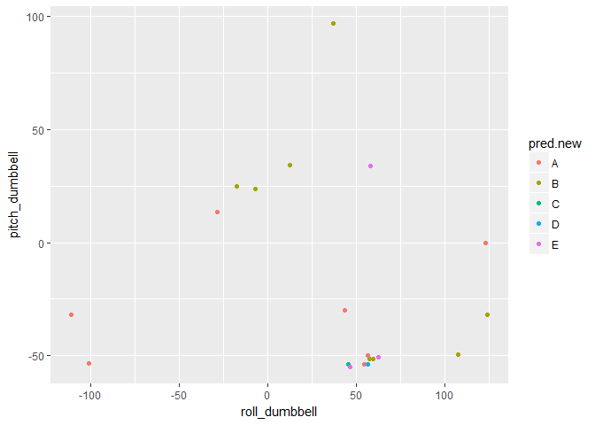

Practical Machine Learning Assignment
-------------------------------------

### Overview

The data collect information from accelerometers on the belt, forearm, arm, and dumbell while doing 5 different ways. The goal is to predict the manner people exercise throught the accelerometer readings.

### Analysis

-   Load and clean data

The training and testing files are downloaded from the course website and saved in the working directory.

``` r
pml.train <- read.csv("pml-training.csv", na.strings = c("NA", ""))
pml.test <- read.csv("pml-testing.csv", na.strings = c("NA", ""))
str(pml.train)
```

    ## 'data.frame':    19622 obs. of  160 variables:
    ##  $ X                       : int  1 2 3 4 5 6 7 8 9 10 ...
    ##  $ user_name               : Factor w/ 6 levels "adelmo","carlitos",..: 2 2 2 2 2 2 2 2 2 2 ...
    ##  $ raw_timestamp_part_1    : int  1323084231 1323084231 1323084231 1323084232 1323084232 1323084232 1323084232 1323084232 1323084232 1323084232 ...
    ##  $ raw_timestamp_part_2    : int  788290 808298 820366 120339 196328 304277 368296 440390 484323 484434 ...
    ##  $ cvtd_timestamp          : Factor w/ 20 levels "02/12/2011 13:32",..: 9 9 9 9 9 9 9 9 9 9 ...
    ##  $ new_window              : Factor w/ 2 levels "no","yes": 1 1 1 1 1 1 1 1 1 1 ...
    ##  $ num_window              : int  11 11 11 12 12 12 12 12 12 12 ...
    ##  $ roll_belt               : num  1.41 1.41 1.42 1.48 1.48 1.45 1.42 1.42 1.43 1.45 ...
    ##  $ pitch_belt              : num  8.07 8.07 8.07 8.05 8.07 8.06 8.09 8.13 8.16 8.17 ...
    ##  $ yaw_belt                : num  -94.4 -94.4 -94.4 -94.4 -94.4 -94.4 -94.4 -94.4 -94.4 -94.4 ...
    ##  $ total_accel_belt        : int  3 3 3 3 3 3 3 3 3 3 ...
    ##  $ kurtosis_roll_belt      : Factor w/ 396 levels "-0.016850","-0.021024",..: NA NA NA NA NA NA NA NA NA NA ...
    ##  $ kurtosis_picth_belt     : Factor w/ 316 levels "-0.021887","-0.060755",..: NA NA NA NA NA NA NA NA NA NA ...
    ##  $ kurtosis_yaw_belt       : Factor w/ 1 level "#DIV/0!": NA NA NA NA NA NA NA NA NA NA ...
    ##  $ skewness_roll_belt      : Factor w/ 394 levels "-0.003095","-0.010002",..: NA NA NA NA NA NA NA NA NA NA ...
    ##  $ skewness_roll_belt.1    : Factor w/ 337 levels "-0.005928","-0.005960",..: NA NA NA NA NA NA NA NA NA NA ...
    ##  $ skewness_yaw_belt       : Factor w/ 1 level "#DIV/0!": NA NA NA NA NA NA NA NA NA NA ...
    ##  $ max_roll_belt           : num  NA NA NA NA NA NA NA NA NA NA ...
    ##  $ max_picth_belt          : int  NA NA NA NA NA NA NA NA NA NA ...
    ##  $ max_yaw_belt            : Factor w/ 67 levels "-0.1","-0.2",..: NA NA NA NA NA NA NA NA NA NA ...
    ##  $ min_roll_belt           : num  NA NA NA NA NA NA NA NA NA NA ...
    ##  $ min_pitch_belt          : int  NA NA NA NA NA NA NA NA NA NA ...
    ##  $ min_yaw_belt            : Factor w/ 67 levels "-0.1","-0.2",..: NA NA NA NA NA NA NA NA NA NA ...
    ##  $ amplitude_roll_belt     : num  NA NA NA NA NA NA NA NA NA NA ...
    ##  $ amplitude_pitch_belt    : int  NA NA NA NA NA NA NA NA NA NA ...
    ##  $ amplitude_yaw_belt      : Factor w/ 3 levels "#DIV/0!","0.00",..: NA NA NA NA NA NA NA NA NA NA ...
    ##  $ var_total_accel_belt    : num  NA NA NA NA NA NA NA NA NA NA ...
    ##  $ avg_roll_belt           : num  NA NA NA NA NA NA NA NA NA NA ...
    ##  $ stddev_roll_belt        : num  NA NA NA NA NA NA NA NA NA NA ...
    ##  $ var_roll_belt           : num  NA NA NA NA NA NA NA NA NA NA ...
    ##  $ avg_pitch_belt          : num  NA NA NA NA NA NA NA NA NA NA ...
    ##  $ stddev_pitch_belt       : num  NA NA NA NA NA NA NA NA NA NA ...
    ##  $ var_pitch_belt          : num  NA NA NA NA NA NA NA NA NA NA ...
    ##  $ avg_yaw_belt            : num  NA NA NA NA NA NA NA NA NA NA ...
    ##  $ stddev_yaw_belt         : num  NA NA NA NA NA NA NA NA NA NA ...
    ##  $ var_yaw_belt            : num  NA NA NA NA NA NA NA NA NA NA ...
    ##  $ gyros_belt_x            : num  0 0.02 0 0.02 0.02 0.02 0.02 0.02 0.02 0.03 ...
    ##  $ gyros_belt_y            : num  0 0 0 0 0.02 0 0 0 0 0 ...
    ##  $ gyros_belt_z            : num  -0.02 -0.02 -0.02 -0.03 -0.02 -0.02 -0.02 -0.02 -0.02 0 ...
    ##  $ accel_belt_x            : int  -21 -22 -20 -22 -21 -21 -22 -22 -20 -21 ...
    ##  $ accel_belt_y            : int  4 4 5 3 2 4 3 4 2 4 ...
    ##  $ accel_belt_z            : int  22 22 23 21 24 21 21 21 24 22 ...
    ##  $ magnet_belt_x           : int  -3 -7 -2 -6 -6 0 -4 -2 1 -3 ...
    ##  $ magnet_belt_y           : int  599 608 600 604 600 603 599 603 602 609 ...
    ##  $ magnet_belt_z           : int  -313 -311 -305 -310 -302 -312 -311 -313 -312 -308 ...
    ##  $ roll_arm                : num  -128 -128 -128 -128 -128 -128 -128 -128 -128 -128 ...
    ##  $ pitch_arm               : num  22.5 22.5 22.5 22.1 22.1 22 21.9 21.8 21.7 21.6 ...
    ##  $ yaw_arm                 : num  -161 -161 -161 -161 -161 -161 -161 -161 -161 -161 ...
    ##  $ total_accel_arm         : int  34 34 34 34 34 34 34 34 34 34 ...
    ##  $ var_accel_arm           : num  NA NA NA NA NA NA NA NA NA NA ...
    ##  $ avg_roll_arm            : num  NA NA NA NA NA NA NA NA NA NA ...
    ##  $ stddev_roll_arm         : num  NA NA NA NA NA NA NA NA NA NA ...
    ##  $ var_roll_arm            : num  NA NA NA NA NA NA NA NA NA NA ...
    ##  $ avg_pitch_arm           : num  NA NA NA NA NA NA NA NA NA NA ...
    ##  $ stddev_pitch_arm        : num  NA NA NA NA NA NA NA NA NA NA ...
    ##  $ var_pitch_arm           : num  NA NA NA NA NA NA NA NA NA NA ...
    ##  $ avg_yaw_arm             : num  NA NA NA NA NA NA NA NA NA NA ...
    ##  $ stddev_yaw_arm          : num  NA NA NA NA NA NA NA NA NA NA ...
    ##  $ var_yaw_arm             : num  NA NA NA NA NA NA NA NA NA NA ...
    ##  $ gyros_arm_x             : num  0 0.02 0.02 0.02 0 0.02 0 0.02 0.02 0.02 ...
    ##  $ gyros_arm_y             : num  0 -0.02 -0.02 -0.03 -0.03 -0.03 -0.03 -0.02 -0.03 -0.03 ...
    ##  $ gyros_arm_z             : num  -0.02 -0.02 -0.02 0.02 0 0 0 0 -0.02 -0.02 ...
    ##  $ accel_arm_x             : int  -288 -290 -289 -289 -289 -289 -289 -289 -288 -288 ...
    ##  $ accel_arm_y             : int  109 110 110 111 111 111 111 111 109 110 ...
    ##  $ accel_arm_z             : int  -123 -125 -126 -123 -123 -122 -125 -124 -122 -124 ...
    ##  $ magnet_arm_x            : int  -368 -369 -368 -372 -374 -369 -373 -372 -369 -376 ...
    ##  $ magnet_arm_y            : int  337 337 344 344 337 342 336 338 341 334 ...
    ##  $ magnet_arm_z            : int  516 513 513 512 506 513 509 510 518 516 ...
    ##  $ kurtosis_roll_arm       : Factor w/ 329 levels "-0.02438","-0.04190",..: NA NA NA NA NA NA NA NA NA NA ...
    ##  $ kurtosis_picth_arm      : Factor w/ 327 levels "-0.00484","-0.01311",..: NA NA NA NA NA NA NA NA NA NA ...
    ##  $ kurtosis_yaw_arm        : Factor w/ 394 levels "-0.01548","-0.01749",..: NA NA NA NA NA NA NA NA NA NA ...
    ##  $ skewness_roll_arm       : Factor w/ 330 levels "-0.00051","-0.00696",..: NA NA NA NA NA NA NA NA NA NA ...
    ##  $ skewness_pitch_arm      : Factor w/ 327 levels "-0.00184","-0.01185",..: NA NA NA NA NA NA NA NA NA NA ...
    ##  $ skewness_yaw_arm        : Factor w/ 394 levels "-0.00311","-0.00562",..: NA NA NA NA NA NA NA NA NA NA ...
    ##  $ max_roll_arm            : num  NA NA NA NA NA NA NA NA NA NA ...
    ##  $ max_picth_arm           : num  NA NA NA NA NA NA NA NA NA NA ...
    ##  $ max_yaw_arm             : int  NA NA NA NA NA NA NA NA NA NA ...
    ##  $ min_roll_arm            : num  NA NA NA NA NA NA NA NA NA NA ...
    ##  $ min_pitch_arm           : num  NA NA NA NA NA NA NA NA NA NA ...
    ##  $ min_yaw_arm             : int  NA NA NA NA NA NA NA NA NA NA ...
    ##  $ amplitude_roll_arm      : num  NA NA NA NA NA NA NA NA NA NA ...
    ##  $ amplitude_pitch_arm     : num  NA NA NA NA NA NA NA NA NA NA ...
    ##  $ amplitude_yaw_arm       : int  NA NA NA NA NA NA NA NA NA NA ...
    ##  $ roll_dumbbell           : num  13.1 13.1 12.9 13.4 13.4 ...
    ##  $ pitch_dumbbell          : num  -70.5 -70.6 -70.3 -70.4 -70.4 ...
    ##  $ yaw_dumbbell            : num  -84.9 -84.7 -85.1 -84.9 -84.9 ...
    ##  $ kurtosis_roll_dumbbell  : Factor w/ 397 levels "-0.0035","-0.0073",..: NA NA NA NA NA NA NA NA NA NA ...
    ##  $ kurtosis_picth_dumbbell : Factor w/ 400 levels "-0.0163","-0.0233",..: NA NA NA NA NA NA NA NA NA NA ...
    ##  $ kurtosis_yaw_dumbbell   : Factor w/ 1 level "#DIV/0!": NA NA NA NA NA NA NA NA NA NA ...
    ##  $ skewness_roll_dumbbell  : Factor w/ 400 levels "-0.0082","-0.0096",..: NA NA NA NA NA NA NA NA NA NA ...
    ##  $ skewness_pitch_dumbbell : Factor w/ 401 levels "-0.0053","-0.0084",..: NA NA NA NA NA NA NA NA NA NA ...
    ##  $ skewness_yaw_dumbbell   : Factor w/ 1 level "#DIV/0!": NA NA NA NA NA NA NA NA NA NA ...
    ##  $ max_roll_dumbbell       : num  NA NA NA NA NA NA NA NA NA NA ...
    ##  $ max_picth_dumbbell      : num  NA NA NA NA NA NA NA NA NA NA ...
    ##  $ max_yaw_dumbbell        : Factor w/ 72 levels "-0.1","-0.2",..: NA NA NA NA NA NA NA NA NA NA ...
    ##  $ min_roll_dumbbell       : num  NA NA NA NA NA NA NA NA NA NA ...
    ##  $ min_pitch_dumbbell      : num  NA NA NA NA NA NA NA NA NA NA ...
    ##  $ min_yaw_dumbbell        : Factor w/ 72 levels "-0.1","-0.2",..: NA NA NA NA NA NA NA NA NA NA ...
    ##  $ amplitude_roll_dumbbell : num  NA NA NA NA NA NA NA NA NA NA ...
    ##   [list output truncated]

The first 6 columns are user ID, name and timestamp, and are deleted

``` r
pml.train <- pml.train[, c(-6:-1)]
pml.test <- pml.test[, c(-6:-1)]
```

Since many columns contain NA that has no information, only columns with all non-NA data are kept.

``` r
pml.train <- pml.train[, apply(!is.na(pml.train), 2, all)]
pml.test <- pml.test[, apply(!is.na(pml.test), 2, all)]
```

-   Modeling

This is a classification problem.

Random forest is used to model the data. Cross validation of 5 fold is used to tune the model

Initially, all sample are used to fit the model, but it takes very long time.

The training data is split into 2 sets: one for the train (10%), and the other for the testing (90%).

``` r
library(caret)
```

    ## Loading required package: lattice

    ## Loading required package: ggplot2

``` r
InTrain <- createDataPartition(y = pml.train$classe, p = 0.1, list = FALSE)
pml.train.1 <- pml.train[InTrain, ]
pml.train.2 <- pml.train[-InTrain,]
```

Fit random forest model with cross validation of 5 fold

``` r
library(randomForest)
```

    ## randomForest 4.6-12

    ## Type rfNews() to see new features/changes/bug fixes.

    ## 
    ## Attaching package: 'randomForest'

    ## The following object is masked from 'package:ggplot2':
    ## 
    ##     margin

``` r
model.rf <- train(classe ~., data = pml.train.1, method = "rf", trControl = trainControl(method = "cv", number = 5), prox = TRUE, allowParallel = TRUE)
print(model.rf)
```

    ## Random Forest 
    ## 
    ## 1964 samples
    ##   53 predictor
    ##    5 classes: 'A', 'B', 'C', 'D', 'E' 
    ## 
    ## No pre-processing
    ## Resampling: Cross-Validated (5 fold) 
    ## Summary of sample sizes: 1572, 1571, 1570, 1572, 1571 
    ## Resampling results across tuning parameters:
    ## 
    ##   mtry  Accuracy   Kappa    
    ##    2    0.9424727  0.9271576
    ##   27    0.9557160  0.9439193
    ##   53    0.9496091  0.9362182
    ## 
    ## Accuracy was used to select the optimal model using  the largest value.
    ## The final value used for the model was mtry = 27.

The final model uses mtry of 27. The accuray is 95.4%.

Use this model for the testing data.

``` r
pred <- predict(model.rf, pml.train.2)
sum(pred == factor(pml.train.2$classe)) / length(pred)
```

    ## [1] 0.9610941

The testing accuracy is 96.0%

-   Predict new data

``` r
pred.new <- predict(model.rf, pml.test)
pred.new
```

    ##  [1] B A B A A E D B A A B C B A E E A B B B
    ## Levels: A B C D E

-   plot of 2 featurs, roll\_dumbbell and pitch\_dumbbell, of the new data

``` r
qplot(roll_dumbbell, pitch_dumbbell, col = pred.new, data = pml.test) + geom_point()
```



### Conclusion

1.  The data is fit into a random forest model
2.  The accuracy is 95.4% for the training set and 96.0% for the testing set
3.  New data set is predicted
